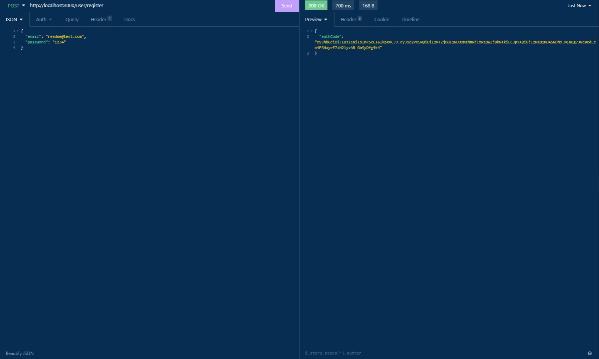
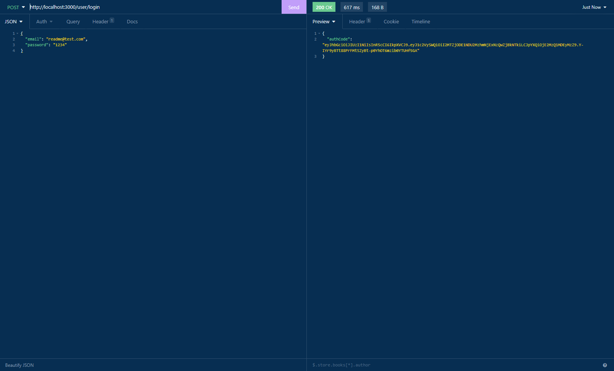
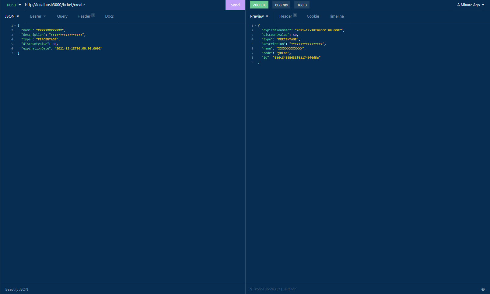
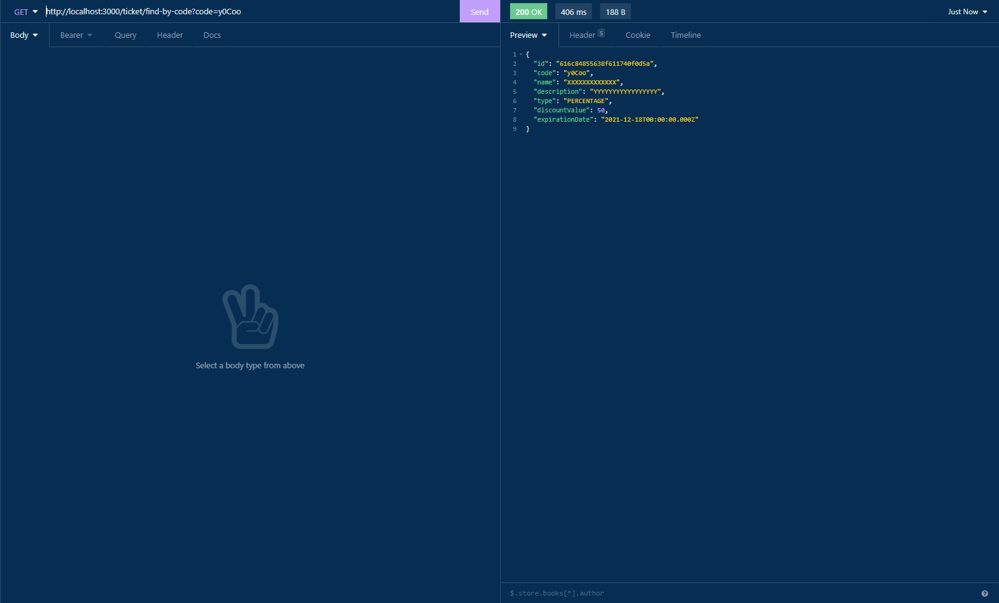
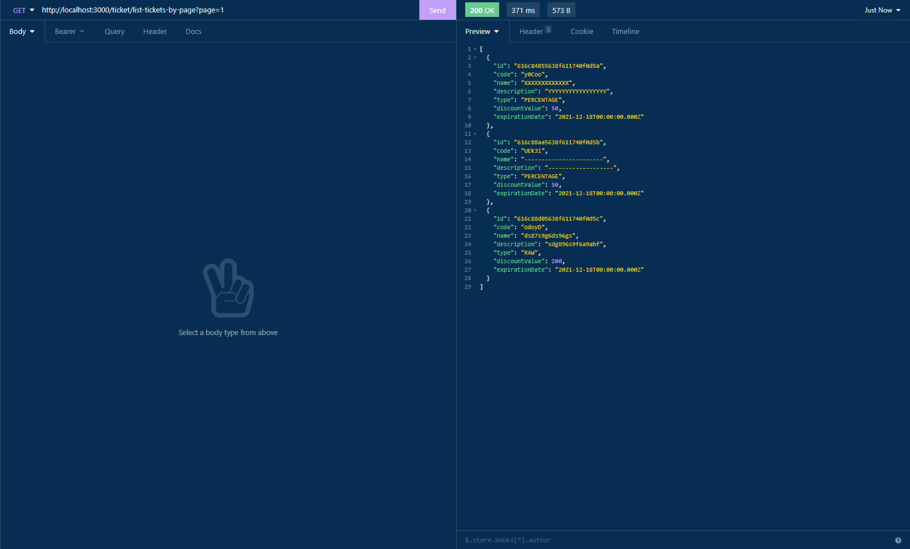

# Ticket Project BackEnd

Ticket project with user registration, user login and ticket creation through authenticated users.

## How to run the project

### Necessary tools

- Yarn
- MongoDB Atlas
- NodeJs

### Protocol

- Install all the dependencies with `yarn` terminal command
- Create a new `.env` file with the same structure of `.env.sample`
- Fill the MONGODB_URL field in `.env` file with the connection link from MongoDB Atlas
- Fill the JWT_PRIVATE_KEY field in `.env` file with a password of your choice
- Run the project with `yarn dev` terminal command

### How to test

- Run `yarn test` terminal command

## Used concepts

- DDD architecture
- Dependency injection
- Unit testing

## Dev tools

- Husky
- Eslint
- Lint-staged
- Nvm
- EditorConfig

## Routes

### **POST** - `/user/register` - User registration

User register route that checks for duplicated emails.

#### Inputs

| parameter | type   | description   |
| --------- | ------ | ------------- |
| email     | string | user email    |
| password  | string | user password |

#### Outputs

| data       | value              |
| ---------- | ------------------ |
| statusCode | 201                |
| response   | Authorization code |

#### Demonstration

### **POST** - `/user/login` - User login

User login route with email and password parameters.

#### Inputs

| parameter | type   | description   |
| --------- | ------ | ------------- |
| email     | string | user email    |
| password  | string | user password |

#### Outputs

| data       | value              |
| ---------- | ------------------ |
| statusCode | 201                |
| response   | Authorization code |

#### Demonstration

### **POST** - `/ticket/create` - Ticket creation

Ticket creation route with duplicated ticket code checking. Parameter `code` is not required and will be generated if not supplied by user. Ticket type must be either "RAW" or "PERCENTAGE". The user must be logged for authorization.

#### Inputs

| parameter      | type                    | description                         |
| -------------- | ----------------------- | ----------------------------------- |
| code?          | string                  | ticket code                         |
| name           | string                  | ticket name                         |
| description    | string                  | ticket description                  |
| type           | TicketTypeEnum (string) | type of discount: RAW or PERCENTAGE |
| discountValue  | number                  | ticket discount value               |
| expirationDate | Date                    | ticket expiration date              |

#### Outputs

| data       | value          |
| ---------- | -------------- |
| statusCode | 201            |
| response   | created ticket |

#### Demonstration

### **GET** - `/ticket/count-tickets` - Ticket counter

Route that counts all the tickets created. The user must be logged for authorization.

#### Inputs

Only the URL.

#### Outputs

| data       | value                     |
| ---------- | ------------------------- |
| statusCode | 200                       |
| response   | number of created tickets |

#### Demonstration

### **GET** - `/ticket/find-by-code` - Find ticket by code

Ticket finding route that accepts a code supplied by the user through query (e.g. /ticket/find-by-code?code=XXXXX) and search for a ticket with the same code in database. The user must be logged for authorization.

#### Inputs

| parameter | type   | description |
| --------- | ------ | ----------- |
| code      | string | ticket code |

#### Outputs

| data       | value                         |
| ---------- | ----------------------------- |
| statusCode | 200                           |
| response   | ticket with the supplied code |

#### Demonstration

### **GET** - `/ticket/list-tickets-by-page` - List up to 10 tickets by page number

Route that list up to 10 tickets by page number from query string (e.g. /ticket/list-tickets-by-page?page=2). If no page is supplied, returns the first page. The user must be logged for authorization.

#### Inputs

| parameter | type   | description        |
| --------- | ------ | ------------------ |
| page?     | number | number of the page |

#### Outputs

| data       | value                                  |
| ---------- | -------------------------------------- |
| statusCode | 200                                    |
| response   | up to 10 tickets in the requested page |

#### Demonstration

